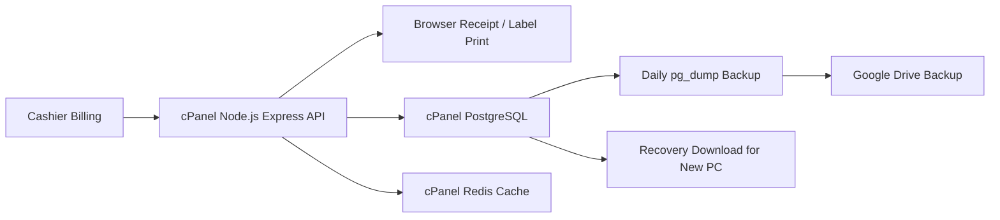

# M&M POS cPanel Cloud Deployment

This deployment runs the cloud API for the web POS system:

1. Billing and inventory screens call the hosted API.
2. PostgreSQL stores the cloud replica for recovery, backup, reports, and future multi-device access.
3. Redis is used only for API cache acceleration. If Redis fails, core API requests still continue.

## Architecture



## Files In This Folder

- `postgresql-schema.sql`: production PostgreSQL cloud schema with sync-safe unique keys.
- `.env.production.example`: cPanel Application Manager environment variables.
- `ecosystem.config.cjs`: optional PM2 process config when your cPanel plan supports PM2.
- `scripts/cloud-backup.mjs`: daily PostgreSQL backup and optional Google Drive upload.
- `package.json`: helper scripts for cPanel deployment tasks.

## cPanel Setup

1. Open cPanel > PostgreSQL Databases.
2. Create a database, for example `cpaneluser_mmpos`.
3. Create a database user with a strong password.
4. Add the user to the database with all privileges.
5. Open Remote Database Access and allow only your shop static IP if remote access is needed.
6. Open Redis in cPanel and copy the local Redis URL, usually `redis://127.0.0.1:6379`.
7. Open Setup Node.js App / Application Manager.
8. Create an app:
   - Node version: 20 or newer
   - Application mode: Production
   - Application root: `server`
   - Startup file: `dist/server.js`
   - Application URL: your API subdomain, for example `https://api.mmsupermart.in`
9. Add the variables from `.env.production.example` in cPanel.
10. Upload the project files or deploy from your Git repository.

## PostgreSQL Schema Install

Run this once from cPanel Terminal:

```bash
psql "$DATABASE_URL" -f deploy/cpanel/postgresql-schema.sql
```

If cPanel does not expose `psql`, import `postgresql-schema.sql` from phpPgAdmin or your hosting PostgreSQL tool.

## Build And Start API

From the project root on cPanel:

```bash
npm install
npm --workspace server run build
npm --workspace server run start
```

For Application Manager, cPanel starts `server/dist/server.js` automatically after the build.

## Optional PM2

Use PM2 only if your cPanel hosting enables it:

```bash
cd server
pm2 start ../deploy/cpanel/ecosystem.config.cjs
pm2 save
```

## POS Cloud Settings

Set the web client API URL to the hosted API:

```env
NEXT_PUBLIC_API_URL=https://api.mmsupermart.in/api
```

## Sync Endpoints Already Used By The API

- `GET /api/sync/status`
- `POST /api/sync/sales`
- `POST /api/sync/products`
- `POST /api/sync/customers`
- `POST /api/sync/inventory`
- `POST /api/sync/payments`
- `POST /api/sync/bulk`

All sync requests must include:

```http
X-Sync-Token: your-sync-secret
```

## Redis Cache

Set `REDIS_URL` in cPanel. Product list and search responses use short-lived Redis cache. This improves API speed without risking stale billing because local SQLite remains the billing source.

## Daily Cloud Backup

Add a cPanel Cron Job for 10 PM daily:

```bash
cd /home/YOUR_CPANEL_USER/path-to-project && node deploy/cpanel/scripts/cloud-backup.mjs
```

The script:

- Runs `pg_dump` against `DATABASE_URL`.
- Writes `storeid-postgres-backup-YYYY-MM-DD-HH-MM.dump`.
- Verifies file size.
- Calculates SHA-256 checksum.
- Uploads to Google Drive when `GOOGLE_DRIVE_ENABLED=true`.
- Deletes local cloud backups older than `CLOUD_BACKUP_RETENTION_DAYS`.

## Google Drive Backup

1. Create a Google Cloud service account.
2. Enable Google Drive API.
3. Create a Drive folder named `MMSuperMart Backups`.
4. Share that folder with the service account email.
5. Put the folder id in `GOOGLE_DRIVE_BACKUP_FOLDER_ID`.
6. Put the compact service account JSON in `GOOGLE_SERVICE_ACCOUNT_JSON`.
7. Set `GOOGLE_DRIVE_ENABLED=true`.

## Recovery Workflow

New PC recovery:

1. Install M&M POS desktop app.
2. Login with store admin credentials.
3. Restore latest local SQLite backup if available.
4. If local backup is unavailable, download latest Google Drive backup.
5. If Google Drive is unavailable, pull master data from PostgreSQL sync API.
6. Rebuild local SQLite.
7. Resume billing offline.

## Security Rules

- Keep `SYNC_SHARED_SECRET` private and different from `JWT_SECRET`.
- Do not expose PostgreSQL publicly except to known shop IPs.
- Use HTTPS for the API domain.
- Never put Google service account JSON in frontend code.
- Keep cPanel backups and local SQLite backups both enabled.
